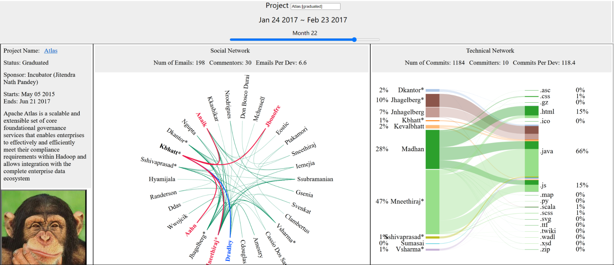

# ASFI Project Explorer (APE)

ASFI Project Explorer (APE) is a long-term research project, in which models and algorithms to integrate and advance the analysis and visualization of social networks and technical networks are being developed. APE is the design and implementation of a software tool intended for research in OSS projects, especially for ASF incubator projects.

# Main features of APE

* Implement an interactive graphical user interface based on D3.js, tailored to both social networks and technical networks.
* Compare graduated projects and retired projects with fine-grained de-aliasing data.
* Provide technical longitudinal information along with the selected <project, month> pair.

# Link to APE
<https://lkyin.github.io/ASFI_Project_Explorer/>
